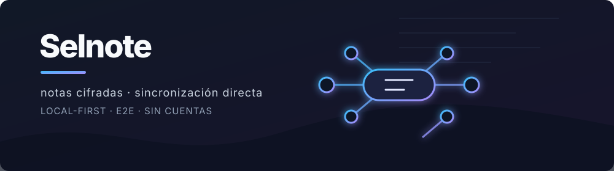
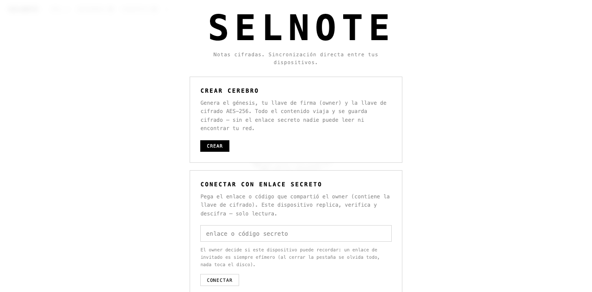

<p align="center">
  
</p>

<p align="center">
  <strong>Notas personales que viven en tu navegador y se sincronizan entre tus propios dispositivos.</strong><br>
  <sub>Sin cuentas, sin un almacén central de contenido y con cifrado de extremo a extremo.</sub>
</p>

<p align="center">
  
  
  
  
</p>

<p align="center">
  
</p>

## Qué es Selnote

Selnote es una aplicación web estática para crear notas y conservar archivos cifrados en el navegador. Replica los cambios entre dispositivos autorizados mediante conexiones directas WebRTC y representa las notas como neuronas alrededor de un cerebro 3D.

No requiere una cuenta ni usa un backend como almacén de notas. La infraestructura de red ayuda a encontrar dispositivos y, cuando la conexión directa falla, puede transportar bytes ya cifrados.

> [!IMPORTANT]
> El enlace secreto contiene la llave que permite encontrar y descifrar el cerebro. No lo publiques ni lo compartas con personas que no deban leer su contenido.

## Probar ahora

Abrí **[Selnote en GitHub Pages](https://anthoniriv.github.io/selnote-web/)** en un navegador moderno.

1. Seleccioná **Crear cerebro**.
2. Creá una nota con el botón **+** o pegá texto, imágenes o archivos.
3. Desde **enlace secreto**, elegí **mi dispositivo** para conectar otro equipo propio o **invitado** para una sesión de lectura temporal.
4. Abrí el enlace en el segundo dispositivo y mantené ambos conectados hasta que aparezca la sinapsis.
5. Editá una nota y comprobá que el cambio llegue al otro dispositivo.

## Inicio rápido

### Crear notas

- **+** abre el editor para crear una nota.
- **⧉** crea una nota desde el portapapeles; en escritorio también podés usar `Ctrl+V` o `⌘V` fuera del editor.
- **⌕** busca por título o contenido. También funcionan `Ctrl/⌘+F`, `Ctrl/⌘+K` y, si el sistema no lo reserva, `Ctrl/⌘+Espacio`.
- Arrastrar archivos sobre la aplicación abre una nota nueva con esos adjuntos.

### Conectar dispositivos

El enlace secreto da acceso al cerebro; el emparejamiento establece una conexión entre dos navegadores. Son pasos distintos:

1. El owner comparte un enlace de **mi dispositivo**.
2. El nuevo dispositivo demuestra criptográficamente que posee la llave del cerebro.
3. El owner registra su permiso de escritura en la cadena firmada.

Para equipos que ya tienen acceso al mismo cerebro, **sin internet** permite intercambiar una oferta y una respuesta WebRTC por texto o QR dentro de la misma red local. Ese código conecta los pares, pero no reemplaza el enlace secreto ni concede permisos por sí solo.

## Mapa de funcionalidades

### Notas e interfaz

- Creación, lectura, edición y eliminación de notas según el permiso del dispositivo.
- Pegado directo de texto, imágenes y archivos; selector múltiple, selector móvil de fotos y vídeos, y arrastrar y soltar.
- Búsqueda por título y contenido con navegación por teclado y enfoque de la neurona encontrada.
- Detección de enlaces `http` y `https` dentro del texto, abiertos en una pestaña aislada.
- Bloques de código con sintaxis de triple acento grave, etiqueta de lenguaje y botón para copiar.
- Fecha local de la última modificación y resúmenes de contenido en las tarjetas.
- Cerebro 3D interactivo: rotación con puntero, zoom con rueda o gesto de pellizco, pulsos al recibir cambios y una rama por nota.
- Vista plana de respaldo si WebGL o la biblioteca 3D local no pueden cargarse.

### Archivos y contenido multimedia

- Adjuntos cifrados de hasta **2 GB por archivo**. El límite efectivo también depende de la cuota y el espacio disponible en el navegador.
- Cifrado y almacenamiento por fragmentos de 256 KB para evitar cargar el archivo completo en memoria durante la ingesta.
- Vista previa de imágenes, reproducción de audio y vídeo, y descarga de cualquier adjunto disponible.
- Verificación SHA-256 del contenido recibido antes de aceptarlo.
- Transferencias reanudables por fragmento, con deduplicación de fragmentos idénticos y reintentos cuando un emisor desaparece.
- Descarga paralela desde varios dispositivos, repartida según la velocidad observada de cada conexión.
- Barra de progreso con porcentaje, velocidad y ruta utilizada: directa, por relevo o mixta.
- Wake Lock cuando el navegador lo permite, para reducir interrupciones mientras hay una transferencia activa.

### Sincronización y red

- Replicación P2P por canales WebRTC; el tracker coordina la señalización, no almacena notas.
- Descubrimiento mediante un tópico derivado de la llave: sin el secreto no se conoce el canal del cerebro.
- Fallback por WebSocket cuando los pares no consiguen una ruta WebRTC directa. El relevo transporta el contenido cifrado por la aplicación.
- Sincronización de la cadena completa al detectar huecos y difusión inmediata de bloques nuevos.
- Convergencia determinista ante ramas simultáneas y reaplicación de cambios propios que hayan quedado fuera de la rama adoptada.
- Reanudación al volver desde segundo plano, limpieza de conexiones obsoletas y reintento de archivos pendientes.
- Control **desconectar/conectar** para aislar el dispositivo de la red sin dejar de usar su copia local.
- Estado visible de red, número de pares y diagnóstico básico cuando no existe una ruta entre dispositivos.
- Emparejamiento local sin salida a Internet mediante oferta/respuesta copiada, compartida o escaneada como QR.

### Transferencia por luz

- Envío de una nota y sus adjuntos directamente de una pantalla a una cámara, sin Wi-Fi, datos móviles ni Bluetooth.
- Secuencia de QR animados con códigos fountain: el receptor puede reconstruir la carga aunque pierda algunos cuadros.
- Límite exacto de **2 MB por envío**, incluyendo texto, metadatos y adjuntos.
- Progreso de emisión y recepción, selección automática de cámara trasera cuando está disponible y reconstrucción local como una nota nueva.

La transferencia por luz no sincroniza dos cerebros ni concede acceso: importa una copia puntual de la nota en el cerebro receptor.

### Dispositivos y permisos

- Dos clases de enlace secreto:
  - **Mi dispositivo:** conserva la identidad y la réplica local; solicita permiso para escribir.
  - **Invitado:** funciona en memoria, es de solo lectura y olvida llaves, bloques y archivos al cerrar la pestaña.
- Identidad Ed25519 propia por dispositivo persistente; la clave privada no sale del navegador.
- Prueba cifrada de posesión de la llave antes de que el owner autorice un dispositivo nuevo.
- Panel con dispositivos autorizados, estado en línea, custodio actual y orden de sucesión.
- Revocación de escritura. El dispositivo revocado conserva lo ya sincronizado y necesita una reautorización explícita para escribir otra vez.
- Lectura, búsqueda y descarga disponibles para invitados y dispositivos sin permiso de escritura.

### Custodia y resiliencia

- Un único dispositivo mantiene la custodia vigente y firma las operaciones administrativas.
- Orden de sucesión firmado y editable por el custodio.
- Traspaso de custodia al primer sucesor conectado cuando el owner cierra la página. Una recarga se distingue de un cierre para no borrar la copia accidentalmente.
- Reclamación de custodia por el primer sucesor disponible después de **60 segundos** sin ver al custodio anterior.
- Purga de una réplica persistente que permanece **5 minutos** sin ninguna sinapsis; la aplicación avisa un minuto antes.
- Recuperación de una réplica local cuya cadena no pasa la verificación: se descarta la cadena corrupta y se intenta resincronizar desde otros dispositivos.
- Eliminación global iniciada por el custodio mediante una sentencia firmada. El modo lápida continúa notificando a dispositivos que estaban apagados cuando vuelven a conectarse.

> [!WARNING]
> El modelo de custodia prioriza que la memoria viva mientras haya dispositivos conectados. Al cerrar como custodio, la copia local puede borrarse y la custodia pasar a un sucesor. Leé el diálogo de confirmación antes de cerrar o eliminar el cerebro.

### Privacidad e integridad

- Notas cifradas con AES-256-GCM antes de persistirse o transferirse.
- Adjuntos cifrados por fragmento y almacenados fuera de la cadena; la cadena conserva descriptores cifrados.
- Historial enlazado por hash y operaciones firmadas con Ed25519.
- Validación del génesis, continuidad de índices y hashes, firmas, autoridad vigente y permisos de escritura antes de aceptar una cadena.
- Llave de cifrado dentro del fragmento `#` del enlace: el navegador no la envía como parte de la solicitud HTTP normal.
- Política CSP restrictiva y bibliotecas JavaScript servidas desde `vendor/`, sin fallback ejecutable a CDN.

El cifrado protege el contenido, no todo el contexto de conexión. Tracker, STUN y TURN o relevo pueden observar metadatos necesarios para establecer la comunicación, como direcciones IP, puertos, horarios, pares participantes y volumen aproximado de tráfico. Consultá [Red y despliegue](docs/networking.md) y el [modelo de amenazas](docs/threat-model.md).

### PWA y operación

- Manifest para instalar Selnote como aplicación independiente cuando el navegador lo permite.
- Service worker con estrategia network-first y respaldo offline para el shell: HTML, manifest, icono y bibliotecas locales.
- Apertura y uso de la réplica local sin Internet después de que el shell haya quedado en caché.
- Precarga de las bibliotecas QR necesarias para el emparejamiento local y la transferencia por luz.
- Comprobación periódica de versión en despliegues que expongan `/version`; la recarga se aplaza mientras el usuario edita o confirma una acción.
- Aplicación estática sin proceso de compilación ni dependencias npm de ejecución.

## Cómo funciona

```text
  escribís una nota
          │
          ▼
  se cifra y se firma en tu navegador
          │
          ├── se guarda localmente en IndexedDB
          │
          └── se replica a dispositivos autorizados
                   │
                   ├── WebRTC directo
                   └── relevo cifrado si no hay ruta directa
```

La cadena registra la secuencia verificable de operaciones. Los binarios se guardan aparte, cifrados y direccionados por hash, para que la sincronización inicial siga siendo ligera y las transferencias puedan reanudarse por fragmentos.

El cambio de nombre a Selnote conserva el nombre heredado de la base IndexedDB y el espacio de descubrimiento del protocolo. Actualizar la aplicación no migra ni borra por sí mismo las notas existentes, y los dispositivos compatibles continúan compartiendo la misma red.

## Arquitectura

El proyecto es una aplicación web estática y autocontenida:

```text
index.html                 interfaz, estilos y lógica principal
manifest.webmanifest       metadatos de instalación
sw.js                      caché del shell offline
vendor/                    Three.js y bibliotecas QR locales
scripts/                   validaciones usadas por la aplicación y la CI
tests/                     pruebas de integridad del repositorio
docs/                      red, despliegue y modelo de amenazas
assets/                    recursos visuales de la documentación
```

| Capa | Tecnología |
|------|------------|
| Interfaz | HTML, CSS y JavaScript vanilla |
| Almacenamiento | IndexedDB del navegador |
| Cifrado e identidad | Web Crypto, AES-GCM, SHA-256 y Ed25519 |
| Sincronización | WebRTC P2P + señalización y relevo WebSocket |
| Experiencia offline | Web App Manifest + Service Worker |
| Visualización | Three.js local con fallback plano |

## Ejecución local

Serví el directorio actual con un servidor de archivos estáticos. Por ejemplo, con Python 3:

```bash
python3 -m http.server 8080
```

Abrí [http://localhost:8080](http://localhost:8080). Usar un servidor local, en vez de abrir el archivo directamente, permite que el navegador aplique correctamente las APIs web que utiliza la aplicación.

Para ejecutar las mismas verificaciones que la CI:

```bash
npm run check
npm test
```

## Límites y recuperación

- Selnote no sustituye una estrategia de respaldo. Si se borran todas las copias del navegador o se pierde el enlace secreto, no existe un servidor central desde el que recuperar el contenido.
- Borrar los datos del sitio elimina la réplica y las llaves guardadas en ese navegador.
- La sincronización requiere que al menos dos dispositivos compatibles coincidan en línea y logren una ruta directa o por relevo.
- Los archivos admiten hasta 2 GB, pero la cuota real depende del navegador y del dispositivo.
- La transferencia por luz admite hasta 2 MB y su velocidad depende de las pantallas, las cámaras y la iluminación.
- Algunas funciones requieren permisos o soporte del navegador: portapapeles, cámara, WebRTC, Web Crypto, IndexedDB, Service Worker y Wake Lock.

## Comunidad y calidad

- [Guía de contribución](CONTRIBUTING.md)
- [Código de conducta](CODE_OF_CONDUCT.md)
- [Política de seguridad](SECURITY.md)
- [Flujo de integración continua](.github/workflows/ci.yml)
- [Red y despliegue](docs/networking.md)
- [Modelo de amenazas](docs/threat-model.md)
- [Licencia MIT](LICENSE)
